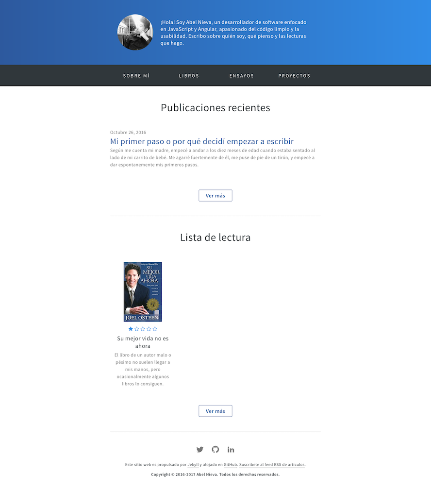

# The ALNA jekyll theme

[](https://travis-ci.org/abel-nieva/alna-jekyll-theme) [](https://badge.fury.io/rb/alna-jekyll-theme)

Abel Nieva website theme for Jekyll built with inuitcss. You can [preview the theme to see what it looks like](https://abelnieva.com), or even [use it today](#usage).



## Usage

To use the ALNA Jekyll theme:

1. Add this line to your Jekyll site's `Gemfile`:

    ```ruby
    gem "alna-jekyll-theme"
    ```

2. And add this line to your Jekyll site's `_config.yml`:

    ```yaml
    theme: alna-jekyll-theme
    ```

## Customizing

### Configuration variables

ALNA jekyll theme will respect the following variables, if set in your site's `_config.yml`:

```yml
title: [The title of your site]
subtitle: [The subtitle of your site]
description: [A short description of your site's purpose]
twitter_username: [Your twitter user name]
author:
  name: [The author name of your site]
  avatar: [The url author avatar]
  avatar2x: [The url author avatar@2x]
  avatar_alt: [The author avatar alt]
  bio: [A short author bio]
```

Additionally, you may choose to set the following optional variables:

```yml
about: [A short description about your site]
copyright: [The copyright of your site]
social_media:
  - name: [The social media name as twitter, facebook and github]
    link: [The social media url]
```

### Stylesheet

If you'd like to add your own custom styles:

1. Create a file called `/assets/css/style.scss` in your site
2. Add the following content to the top of the file, exactly as shown:
    ```scss
    ---
    ---

    @import "{{ site.theme }}";
    ```
3. Add any custom CSS (or Sass, including imports) you'd like immediately after the `@import` line

### Layouts

If you'd like to change the theme's HTML layout:

1. [Copy the original template](https://github.com/abel-nieva/alna-jekyll-theme/blob/master/_layouts/default.html) from the theme's repository<br />(*Pro-tip: click "raw" to make copying easier*)
2. Create a file called `/_layouts/default.html` in your site
3. Paste the default layout content copied in the first step
4. Customize the layout as you'd like

### Content

ALNA Jekyll theme offer different components to customized content and structure of your site. For example, you can create the `index.md` with the `notebook.html` component:

```yml
---
layout: default
---


```

You can also creat the `posts.md` white the `notebook.html` without a limited listing of posts:


```yml
---
layout: page
title: Posts
permalink: /posts/
custom-content: true
---


```

You will find all the components available in `_include` folder.

### Enabling comments (via Disqus)

Optionally, if you have a Disqus account, you can tell Jekyll to use it to show a comments section below each post.

To enable it, add the following lines to your Jekyll site:

```yaml
disqus:
  shortname: my_disqus_shortname
```

You can find out more about Disqus' shortnames [here](https://help.disqus.com/customer/portal/articles/466208).

Comments are enabled by default and will only appear in production, i.e., `JEKYLL_ENV=production`

If you don't want to display comments for a particular post you can disable them by adding `comments: false` to that post's YAML Front Matter.

### Enabling Google Analytics

To enable Google Anaytics, add the following lines to your Jekyll site:

```yaml
google_analytics: UA-NNNNNNNN-N
```

Google Analytics will only appear in production, i.e., `JEKYLL_ENV=production`

## Contributing

Bug reports and pull requests are welcome on GitHub at https://github.com/abel-nieva/alna-jekyll-theme. This project is intended to be a safe, welcoming space for collaboration, and contributors are expected to adhere to the [Contributor Covenant](http://contributor-covenant.org) code of conduct.

## Development

To set up your environment to develop this theme, run `bundle install` and `npm install`.

To test your theme, run `npm start` and open your browser at `http://localhost:4000`. This starts a Jekyll server using your theme. Add pages, documents, data, etc. like normal to test your theme's contents. As you make modifications to your theme and to your content, your site will regenerate and you should see the changes in the browser.

When your theme is released, only the files in `_layouts` and `_includes` tracked with Git will be released.

## License

The theme is available as open source under the terms of the [MIT License](https://opensource.org/licenses/MIT).
